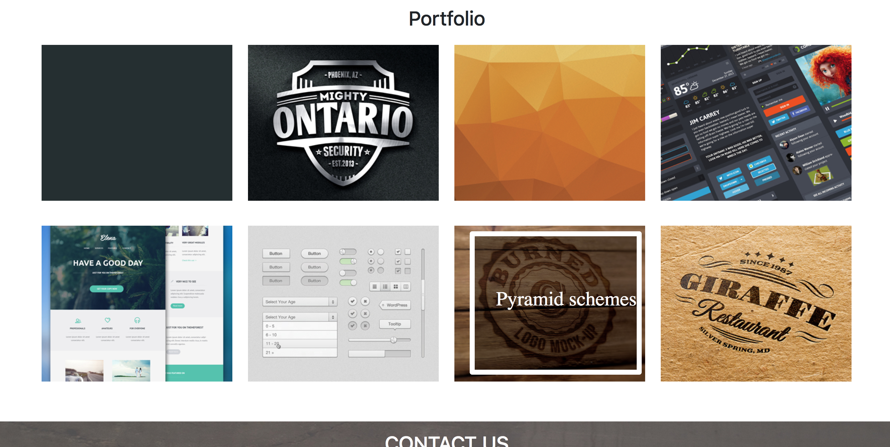
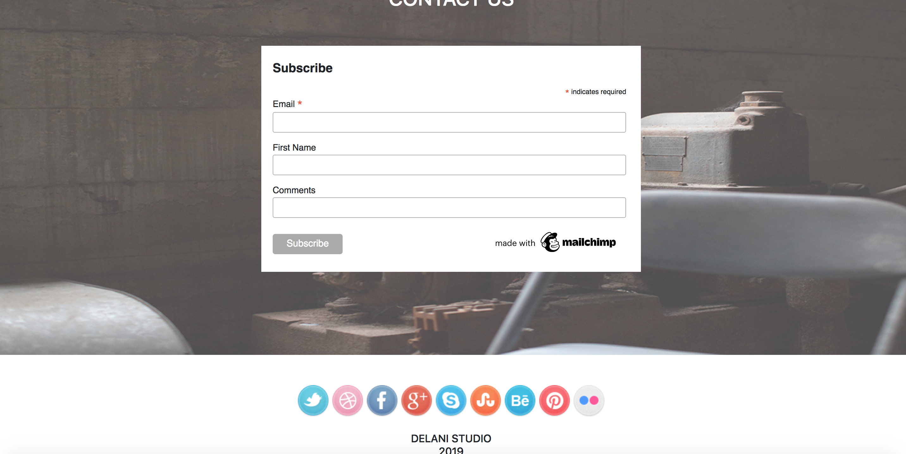

# Delani Studio 
* This a website about Delani studios 

## Author Bruno Gatiba

## Version v1.0.0

## Screen shots 

## Installation 
* Download the repo - clone the repo 
* Run the project or repo 

## Requirements 
* Its compatible with all browsers Safari , mozilla , chrome , fire fox

# Bugs 
* There are no known bugs durin the deployment of the project .

## Technologies used 
* Html 
* css 
* jquery
* mailchimp

## license
* heres a link to my license (license)[license]